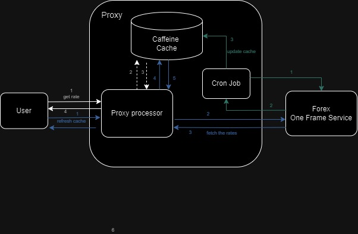
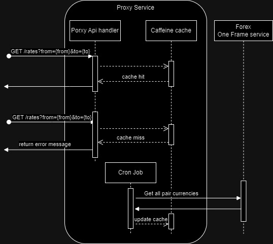

# Forex Proxy Service

## Overview
The Forex Proxy Service is designed to support currency rate retrieval between two specified currencies. 
The service includes a caching mechanism to improve performance and efficiency.
The authentication is required for accessing the API.
While additional features can be integrated, the design aims to remain simple to avoid overcomplicating.

## Diagrams
### Simple Diagram


### Sequence Diagram

## APIs
### Get Exchange Rate
**Endpoint:** `GET /rates?from={from}&to={to}`

- **Parameters:** `{from}` and `{to}` must match the configured currency codes.
- **Authorization:** Bearer token: valid-token
- **Response:** Returns the exchange rate between the specified currencies.

[!NOTE] 
Currently it only supports AUD, CAD, CHF, EUR, GBP, NZD, JPY, SGD, USD.

### Refresh Cache
**Endpoint:** `POST /rates/cache/refresh`

- **Parameters:** None
- **Authorization:** Bearer token: valid-token
- **Response:** None

*Example*
- *Success Response*
```json
{
    "from": "USD",
    "to": "EUR",
    "price": 0.502385191552484575,
    "timestamp": "2024-10-26T05:39:18.657Z"
}
```
- *Error Response*
```json
{
    "status": 500,
    "errorCode": 500,
    "message": "Given currency pair can't find the rate."
}
```

[!Note] 
Currently, all external server issue will return 500 with different message.


## Caching Mechanism
The service uses Caffeine for caching to enhance performance.
- The cache entries expire every 4.5 minutes.
- Upon server startup, the cache is populated, and a cron job refreshes it every 2 minutes.
- Additionally, the cache can be refreshed manually via an API call.

**Exchange Rate Cache:**
 - **Key:** Pair (`from: Currency`, `to: Currency`)
 - **Value:** `{ price: BigDecimal, timestamp: Timestamp }`
 - **Expiration:** Cache entries expire 4.5 minutes after they are written.

## Authorization
The service supports Bearer authorization: "valid-token"

## Test
**Coverage Test**
50%

**Manual Test**

| Test Case                          | expected result                                | passed |
|------------------------------------|------------------------------------------------|--------|
| Get the currency pair USD, EUR     | hit the cache and return the rates             | v      |
| Get the currency pair USD, USD     | return the rates which is 1                    | v      |
|Get the cureency pair USD, TWD | return 400 and Unknown currency: TWD           | v      |
| Get the currency if cache is miss  | return 500 with error message                  | v      |
| Hit the api without the bearer token | return http code 401                           | v      |
| Cron job updates the cache         | check the response timestamp will be different | v      |
| Refresh cache api | The cache timestamp will be changed. | v |
| Forex timeout                      | get the error response with the message        | v      |
| Forex is down                      | get the error response with the message        | v      |

## Future Enhancements
While the current design is kept simple, additional features may be integrated based on future requirements and use cases.

**Security and code quality**
- **Increased Test Coverage:** Current coverage is around 50%. Not only unit test but also consider adding more tests, including functional tests, API tests, and automated testing.
- **Library Updates:** Some libraries may need to be updated to newer versions.
- **Roles setting:** The API responsible for cache updates is not yet restricted by specific roles or tokens.
- **Scala Code Improvements:** There should be better ways or patterns to structure the Scala code, which can enhance readability and maintainability.

**Availability and Resilience**
- **Distributed Service:** The current design uses server-side caching. If multiple proxy nodes are needed, the cache will need to be shared or moved to a different solution.
- **Multiple sources:** Currently, I only use one source Forex service. However, we can also consider having another Forex service or node as backup.
- **Circuit Breaker and Retry Mechanisms:** These configurations need to be discussed and may not be required immediately.

**Monitoring**
- **Enhanced Logging:** Implementing features like x-request-id or request-id would make log tracing easier. Logging external requests can also be considered.
- **Alert:** Since the proxy cache depends on the Forex resource, any errors from the external server or cache misses should trigger alerts.

**Others**
- **Dynamic Configuration:** Develop APIs to allow configuration changes, such as adding new currencies.
- **Token hit the limit:** The current implementation has not been tested for rate limits. This should be monitored, and special handlers could be implemented if needed.
- **Exception Handling:** Only a few specific cases are currently handled. Error codes and messages can be further refined and reorganized.

### Running the Service
1. Clone the repository:
   ```bash
   git clone https://github.com/RyanLin82/proxy.git
2. Docker compose
   ```bash
   #This will run the test so it takes a few minutes
   #before docker-compose please make sure the path is under proxy/forex-mtl
   docker-compose up --build
3. Try it !
   ```bash
   curl -H "Authorization: Bearer valid-token" -X GET "http://localhost:9000/rates?from=USD&to=EUR"